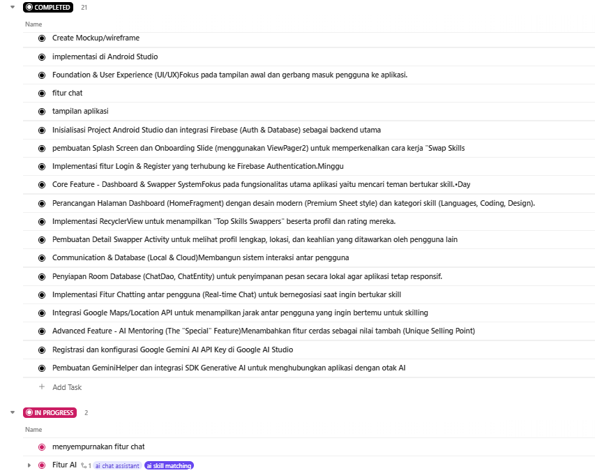
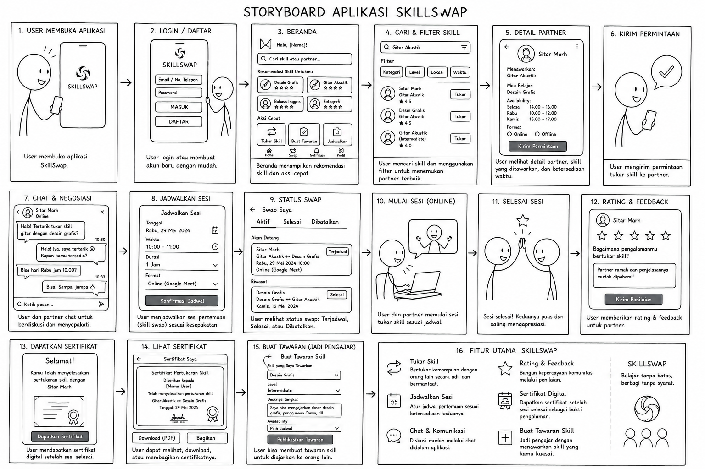
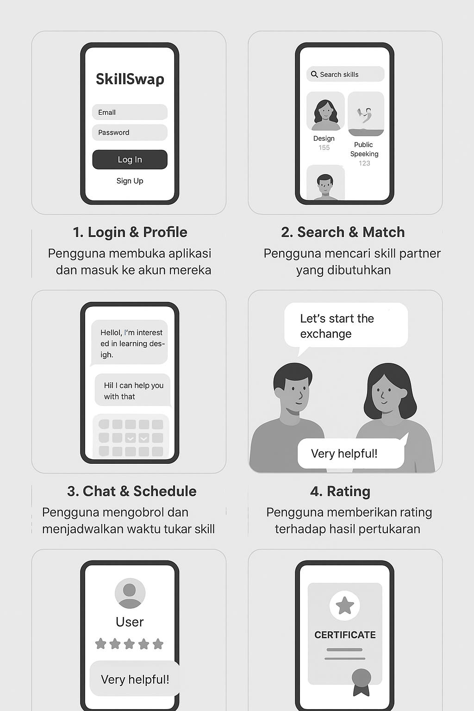
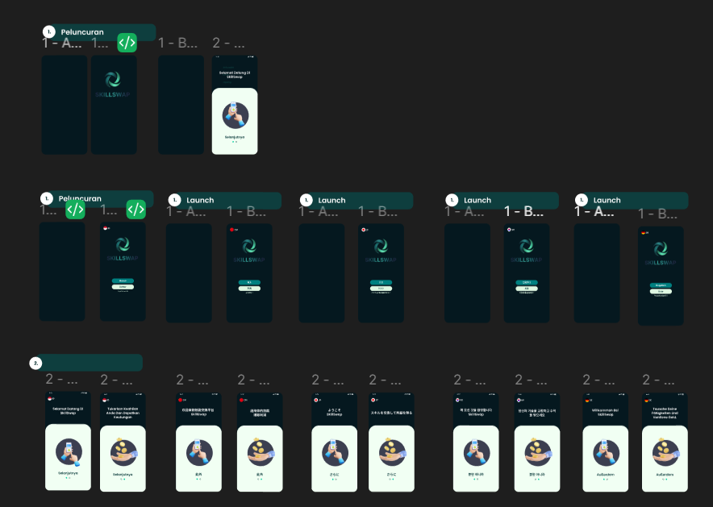
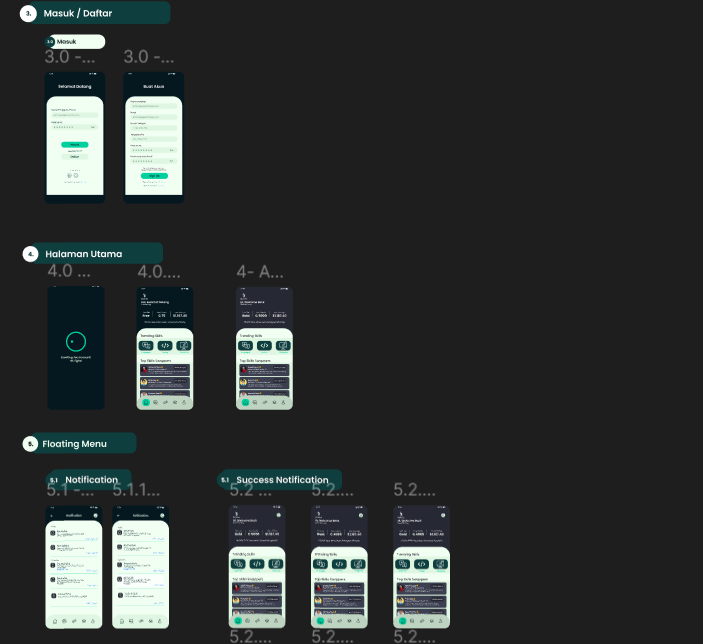
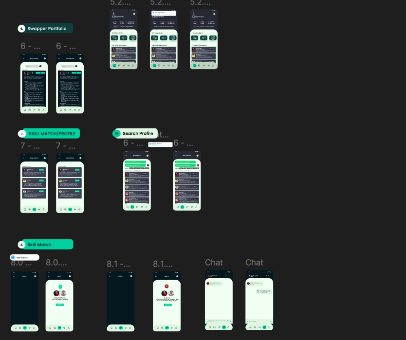
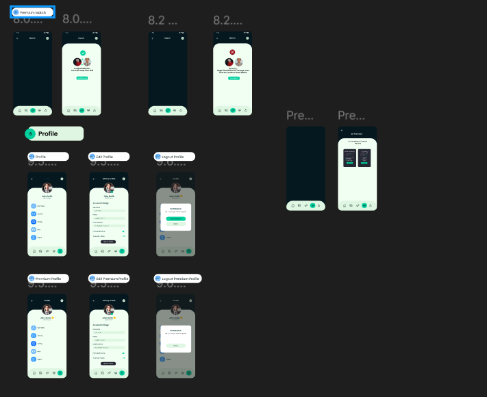
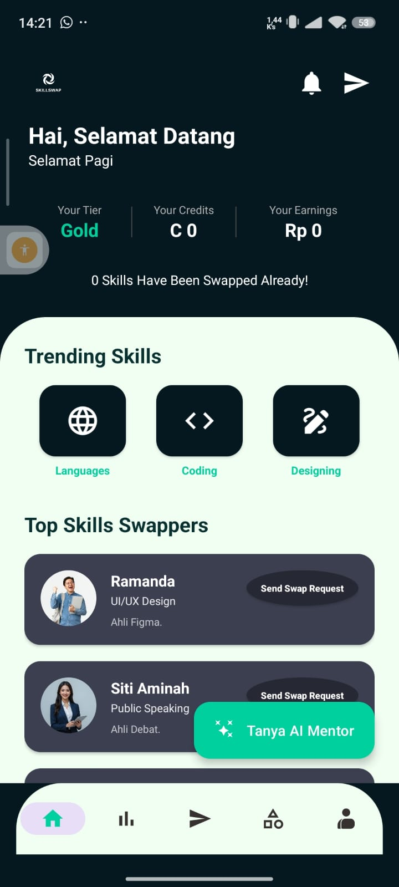
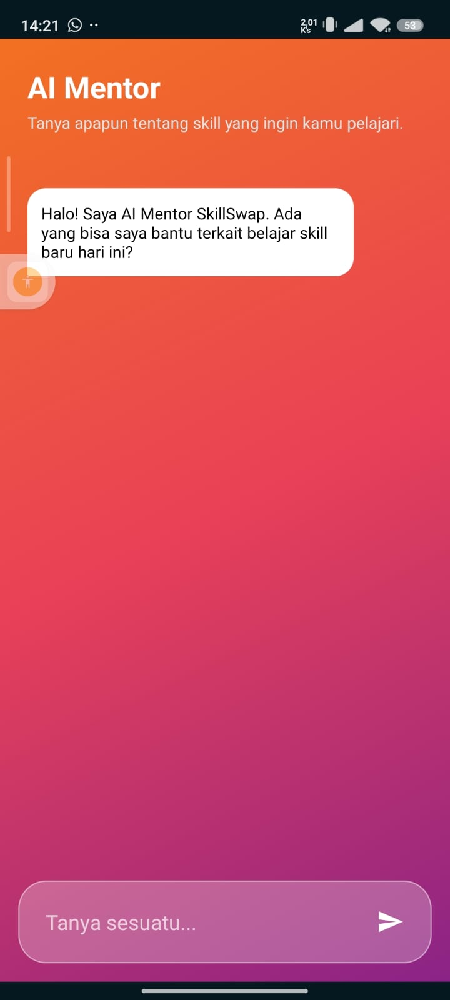

# **SKILLSWAP: Collaborative Learning Ecosystem**

Platform inovatif berbasis mobile yang dirancang untuk memfasilitasi pertukaran keahlian (*skill swapping*) antar pengguna secara real-time, mendukung demokratisasi pengetahuan melalui kolaborasi peer-to-peer.

---

## **Informasi Mahasiswa**
*   **Nama:** Muhammad Aziz Tri Ramadhan
*   **NIM:** 312410380
*   **Fakultas:** Teknik Informatika
*   **Kelas:** i1241c
*   **Mata Kuliah:** Pengembangan Aplikasi Mobile
*   **Dosen Pengampu:** Donny Maulana, S.Kom., M.M.S.I.

---

## **TIMELINE (CLICKUP)**

---

## **1. Analisis Storyboard: User Journey Management**

Storyboard **SkillSwap** dirancang untuk memetakan pengalaman pengguna (*User Experience*) secara holistik, mulai dari fase *entry point* hingga *reward system*. Alur ini terdiri dari 16 fase kritikal:

*   **Entry & Authentication (1-2):** Proses onboarding dan otentikasi yang efisien untuk menjamin integritas data pengguna.
*   **Discovery & Engagement (3-6):** Navigasi beranda yang intuitif dengan fitur filter cerdas untuk mempermudah pencarian mitra belajar yang relevan.
*   **Communication & Scheduling (7-11):** Infrastruktur chat real-time yang memungkinkan negosiasi dan penjadwalan sesi belajar secara terstruktur.
*   **Validation & Certification (12-16):** Mekanisme feedback dua arah dan penerbitan sertifikat digital sebagai bentuk validasi kompetensi pasca-sesi.

---

## **2. Mockup Architecture: High-Fidelity Design**

Mockup aplikasi ini mencerminkan transisi dari konsep abstrak menuju blueprint visual yang fungsional dengan fokus pada:

*   **Seamless Onboarding:** Antarmuka login yang bersih dengan fokus pada kemudahan akses.
*   **Contextual Search:** Desain halaman pencarian yang memprioritaskan visualisasi profil dan keahlian spesifik.
*   **Interactive Match System:** Visualisasi keberhasilan *matching* yang memberikan kepuasan psikologis kepada pengguna (*Match Success Screen*).
*   **Verified Outcomes:** Desain sertifikat digital yang profesional untuk meningkatkan nilai tawar portofolio pengguna.

---

## **3. UI/UX Principles: Professional Design Language**

  
  
  
  

Pengembangan **SkillSwap** mengadopsi standar **Material Design 3 (Material You)** dengan prinsip-prinsip utama:

*   **Usability (Kemudahan Penggunaan):** Implementasi *Navigation Component* yang meminimalkan beban kognitif pengguna saat berpindah antar fitur utama (Home, Analysis, Swap, Category, Profile).
*   **Aesthetics (Estetika):** Penggunaan palet warna *Emerald & Dark Teal* untuk memberikan kesan profesional, modern, dan stabil.
*   **Responsiveness:** Tata letak yang adaptif menggunakan *ConstraintLayout* untuk menjamin konsistensi tampilan di berbagai dimensi layar perangkat Android.
*   **Accessibility:** Memastikan kontras warna yang optimal dan target sentuh yang presisi sesuai standar *Google Human Interface Guidelines*.

---

## **4. AI Mentor Integration: Generative AI Implementation**

   
  

Sebagai fitur unggulan, **SkillSwap** mengintegrasikan **Generative AI (Gemini Pro API)** untuk menghadirkan asisten belajar pintar. Fitur ini dirancang untuk:
*   **Personalized Curriculum:** Membantu pengguna merancang rencana belajar mandiri sebelum melakukan swap skill.
*   **Contextual Assistance:** Memberikan jawaban instan terkait pertanyaan teknis pada bidang keahlian tertentu.
*   **24/7 Availability:** Memastikan pengguna mendapatkan bimbingan meskipun partner belajar sedang tidak tersedia.

Secara teknis, fitur ini diimplementasikan menggunakan arsitektur *asynchronous* untuk memastikan antarmuka tetap responsif saat memproses permintaan AI yang kompleks.

---

## **5. Penjelasan Project: Technical Synopsis**
**SkillSwap** bukan sekadar aplikasi, melainkan sebuah solusi cerdas yang mendemokratisasi proses belajar melalui sistem barter keahlian. Aplikasi ini dibangun dengan stack teknologi modern untuk menjamin stabilitas dan skalabilitas.

### **Fitur Utama Sistem:**
*   **Real-time Synchronization:** Integrasi **Firebase Realtime Database** pada fitur Chat dan Notifikasi untuk memastikan pertukaran informasi tanpa latensi.
*   **Match-Making Logic:** Mekanisme otomatisasi transaksi swap yang secara langsung berdampak pada statistik akun pengguna (*Credits & Earnings*).
*   **Smart Navigation:** Implementasi Fragment-based navigation dengan transisi yang halus antar modul.
*   **Secure Authentication:** Protokol keamanan berlapis menggunakan **Firebase Auth** untuk melindungi data sensitif pengguna.

### **Spesifikasi Teknis:**
*   **Platform:** Android Native (SDK 34+)
*   **Bahasa:** Java Professional Standard
*   **Database:** Firebase Realtime Database & Auth
*   **AI Engine:** Google Generative AI (Gemini)
*   **UI Library:** Google Material Components, CircleImageView, ViewBinding.

---

**SkillSwap** hadir untuk memecahkan hambatan biaya pendidikan tradisional dengan memanfaatkan modal intelektual komunitas sebagai penggerak utama dalam ekosistem belajar masa depan.

*© 2026 SkillSwap Project - Final Project Development.*
